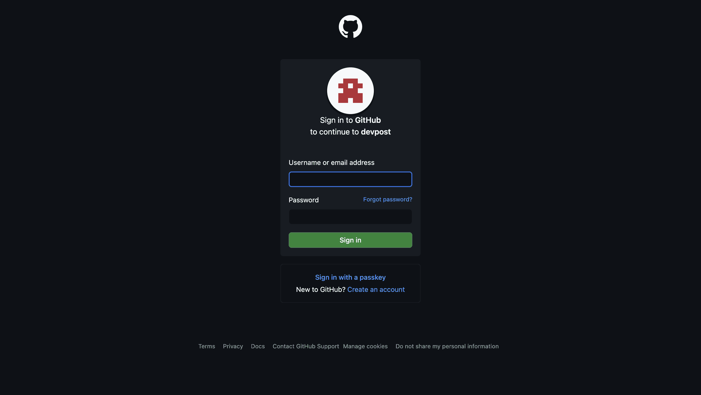
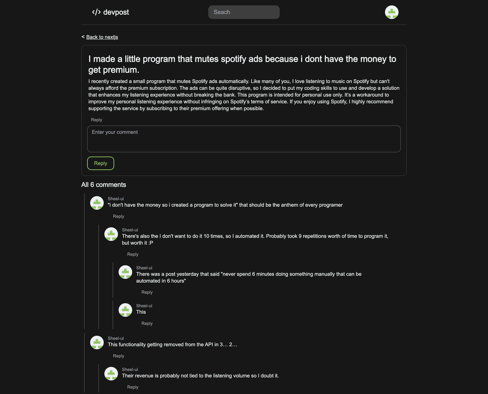
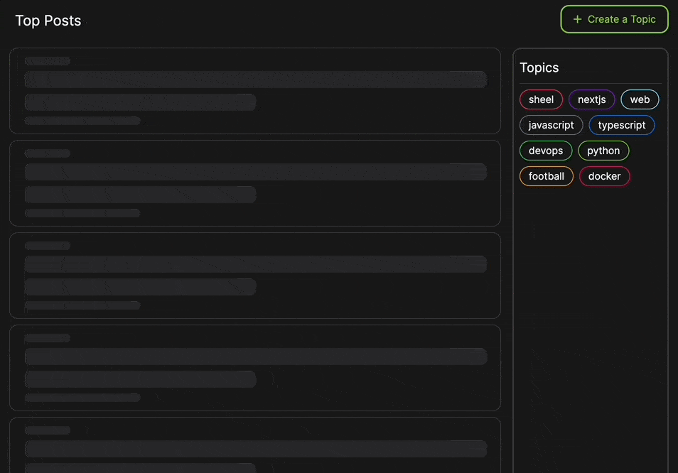

# Devpost

Devpost is a web application that allows users to create topics (similar to subreddits), add posts under these topics, and engage with comments. It is built using Next.js, Tailwind CSS, and Next UI, leveraging modern features provided by the framework. [Watch full demo](https://www.youtube.com/watch?v=h-0dnewHmZE).

## Features

- **Authentication**: Implements OAuth using GitHub for seamless user authentication.

- **Topics and Posts**: Users can create topics and make posts under these topics.

- **Prisma Integration**: Utilizes Prisma client and SQL agent to integrate with the database, ensuring efficient data management.

- **Comments**: Recursively renders nested comments in a Reddit-like fashion, allowing for rich discussion.

- **Search**: Implements keyword-based search functionality for users to easily find topics, posts, and comments based on their interests.

- **Content Streaming**: Optimizes page response times by implementing content streaming with the help of suspense and skeletons, enhancing user experience.

- **Request Deduplication**: Minimizes the number of API requests made to the database by implementing request deduplication, improving performance and reducing server load.

- **Optimized Performance**: Implements best practices such as server actions, route caching, and optimal use of server and client components to ensure fast and responsive user interactions.

- **Efficient Caching**: Employs a comprehensive route caching system to improve performance and ensure up-to-date data display, enhancing overall usability.

## Technologies Used
- Next.js
- Tailwind CSS
- Next UI
- Prisma
- OAuth (GitHub)

## Demo

### Home: List of topics and posts with most comments

<p align="center">
  
</p>

### OAuth: Github authentication

<p align="center">
  
</p>

### Post: Comments section under a post

<p align="center">
  
</p>

### Content Streaming: Displays content till the posts load up

<p align="center">
  
</p>
## How to Use in Local

1. **Clone the Repository**:
    ```bash
    git clone https://github.com/sheel-ui/codeshare.git
    ```
    
2. **Install Dependencies**:
    ```bash
    cd devpost
    npm install
    ```

3. **Setup Environment Variables**:
    Create a `.env` file in the root directory and add your environment variables.

4. **Run the Development Server**:
    ```bash
    npm run dev
    ```

5. **Open Your Browser**:
    Go to `http://localhost:3000`


## How to Deploy

To share the code online, deploy the application using the steps mentioned [here](https://vercel.com/new).